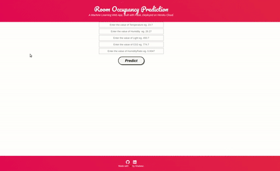

# Predict-Room-Occupancy-Based-on-Environmental-Factors

 * This repository consists of files required to deploy a Machine Learning Web App created with Flask on Heroku platform.
 
   • If you want to view the deployed model, click on the following link: Deployed at: https://room-occupancy.herokuapp.com/
   
   • A glimpse of the web app:

 
 
